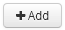

= アノテーションにコストを関連付ける
:allow-uri-read: 
:icons: font
:imagesdir: ../media/

[role="lead"]
コスト関連のレポートを実行する前に、システムレベルのService Level、Switch Level、およびTierのアノテーションにコストを関連付ける必要があります。これにより、本番環境での実際の使用状況やレプリケートされた容量に基づいて、ストレージユーザへのチャージバックが可能になります。たとえば、階層レベルとしてGoldとSilverを設定し、Gold階層にSilver階層よりも高いコストを割り当てることができます。

== 手順

. InsightWeb UIにログインします。
. [管理]をクリックし、*[アノテーション]*を選択します。
+
[Annotation]ページが表示されます。

. Service Level、Switch Level、またはTierのアノテーションにカーソルを合わせ、をクリックします image:../media/edit-annotation-icon.gif[""]。
+
[Edit Annotation]ダイアログボックスが表示されます。

. [コスト]フィールドに既存のレベルの値を入力します。
+
TierアノテーションにはAuto TierとService Levelアノテーションの値が設定されており、Object Storageの値は削除できません。

. をクリックします  をクリックしてレベルを追加します。
. 完了したら、*[保存]*をクリックします。

