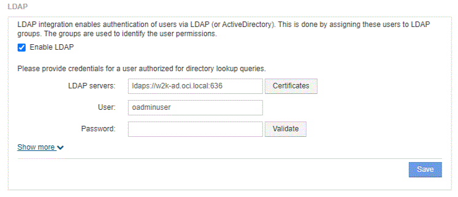

= LDAPを使用したユーザ定義の設定
:allow-uri-read: 
:experimental: 
:icons: font
:imagesdir: ../media/

[role="lead"]
LDAPサーバからのユーザ認証と許可にOnCommand Insight （OCI）を設定するには、LDAPサーバでOnCommand Insight サーバ管理者として定義されている必要があります。

== 作業を開始する前に

LDAPドメインでInsight用に設定されているユーザとグループの属性を確認しておく必要があります。

すべてのSecure Active Directory（LDAPS）ユーザに対して、ADサーバ名は証明書で定義されているとおりに正確に使用する必要があります。セキュアADログインにIPアドレスを使用することはできません。

== このタスクについて

OnCommand Insight は、Microsoft Active Directoryサーバを介したLDAPとLDAPSをサポートしています。その他のLDAP実装でも動作する可能性がありますが、Insightでは確認されていません。この手順 は、Microsoft Active Directoryバージョン2または3のLDAP（Lightweight Directory Access Protocol）を使用していることを前提としています。

LDAPユーザは、ローカルで定義されたユーザとともに* Admin *>メニューのSetup [ Users ]リストに表示されます。

== 手順

. Insightのツールバーで、*[Admin]*をクリックします。
. [設定]*をクリックします。
. [ユーザー]タブをクリックします。
. [LDAP]セクションまでスクロールします（次の図を参照）。
+

. [LDAPを有効にする]*をクリックして、LDAPユーザの認証と許可を許可します。
. 次のフィールドに入力します。
+
** `LDAP servers`：Insightでは、LDAP URLをカンマで区切ったリストを使用できます。LDAPプロトコルを検証せずに、指定されたURLに接続しようとします。
+
[NOTE]
====
LDAP証明書をインポートするには、*[証明書]*をクリックし、証明書ファイルを自動的にインポートするか、手動で検索します。

====
+
LDAPサーバの識別に使用するIPアドレスまたはDNS名は、通常次の形式で入力します。

+
[listing]
----
ldap://<ldap-server-address>:port
----
+
または、デフォルトのポートを使用している場合：

+
[listing]
----
 ldap://<ldap-server-address>
----
+
このフィールドに複数のLDAPサーバを入力する場合は、各エントリで正しいポート番号が使用されていることを確認してください。

** `User name`：LDAPサーバでディレクトリ検索クエリを許可されたユーザのクレデンシャルを入力します。
** `Password`：上記のユーザのパスワードを入力します。LDAPサーバでこのパスワードを確認するには、*[検証]*をクリックします。

. このLDAPユーザをより正確に定義する場合は、*[詳細を表示]*をクリックし、表示された属性のフィールドに入力します。
+
これらの設定は、LDAPドメインで設定されている属性と一致する必要があります。これらのフィールドに入力する値が不明な場合は、Active Directory管理者に確認してください。

+
** *管理者グループ*
+
Insight管理者の権限を持つユーザのLDAPグループ。デフォルトはです `insight.admins`。

** *ユーザーグループ*
+
Insightユーザの権限を持つユーザのLDAPグループ。デフォルトはです `insight.users`。

** *ゲストグループ*
+
Insight Guest権限を持つユーザのLDAPグループ。デフォルトはです `insight.guests`。

** *サーバー管理者グループ*
+
Insight Server管理者権限を持つユーザーのLDAPグループ。デフォルトはです `insight.server.admins`。

** *タイムアウト*
+
タイムアウトするまでにLDAPサーバからの応答を待機する時間（ミリ秒）。デフォルトは2、000です。これはすべてのケースで適切なため、変更しないでください。

** *ドメイン*
+
OnCommand Insight がLDAPユーザの検索を開始するLDAPノード。通常、これは組織のトップレベルドメインです。例：

+
[listing]
----
DC=<enterprise>,DC=com
----
** *ユーザープリンシパル名属性*
+
LDAPサーバ内の各ユーザを識別する属性。デフォルトはです `userPrincipalName`世界的にユニークなものですOnCommand Insight は、この属性の内容を上記で指定したユーザ名と照合しようとします。

** *ロール属性*
+
指定したグループ内でのユーザの適合性を識別するLDAP属性。デフォルトはです `memberOf`。

** *メール属性*
+
ユーザのEメールアドレスを識別するLDAP属性。デフォルトはです `mail`。これは、OnCommand Insight から利用可能なレポートをサブスクライブする場合に便利です。Insightでは、各ユーザが初めてログインしたときにユーザのEメールアドレスが取得され、それ以降は検索されません。

+
[NOTE]
====
LDAPサーバでユーザのEメールアドレスが変更された場合は、Insightでそのアドレスを更新してください。

====
** *識別名属性*
+
ユーザの識別名を識別するLDAP属性。デフォルトはです `distinguishedName`。

. [ 保存（ Save ） ] をクリックします。

