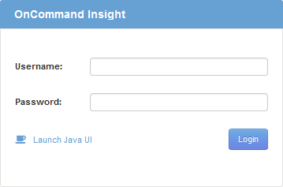

= Web UIへのアクセス
:allow-uri-read: 
:icons: font
:imagesdir: ../media/

[role="lead"]
OnCommand Insight をインストールしたら、ライセンスをインストールし、環境を監視するようにInsightをセットアップする必要があります。そのためには、Webブラウザを使用してInsight Web UIにアクセスします。

== 手順

. 次のいずれかを実行します。
+
** InsightサーバでInsightを開きます。
+
`+https://fqdn+`

** その他の場所からInsightを開きます。
+
`+https://fqdn:port+`

+
ポート番号には、443またはInsight Serverのインストール時に設定した別のポートを指定します。URLで指定しない場合、ポート番号はデフォルトで443になります。

+
OnCommand Insight ダイアログボックスが表示されます。

. ユーザー名とパスワードを入力し、* Login *をクリックします。
+
ライセンスがインストールされている場合は、データソースのセットアップページが表示されます。

+
[NOTE]
====
Insightのブラウザセッションが30分間アクティブでないとタイムアウトになり、システムから自動的にログアウトされます。セキュリティを強化するために、Insightからログアウトしたあとにブラウザを閉じることを推奨します。

====

