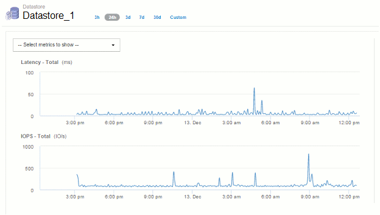

= Time-To-Live （ TTL ）とデータのダウンサンプリング
:allow-uri-read: 
:icons: font
:imagesdir: ../media/

[role="lead"]
OnCommand Insight 7.3以降では、データの保持期間（Time-To-Live）が7日から90日に延長されました。そのため、チャートや表用に処理されるデータがはるかに多く、データポイントが数万に及ぶ可能性があるため、データは表示前にダウンサンプリングされます。

ダウンサンプリングされると、グラフにデータの統計的な概算値が表示されるため、すべてのデータポイントを表示することなく、データの概要を効率的に把握できます。また、収集したデータは常に正確に把握できます。

== ダウンサンプリングが必要な理由

Insight 7.3では、データのTime-To-Live（TTL）が90日に延長されています。これは、グラフやグラフに表示するデータを準備するために必要な処理量が増加することを意味します。グラフをすばやく効率的に表示できるように、データはダウンサンプリングされ、グラフの全体的な形状が維持されます。そのため、そのグラフのすべてのデータポイントを処理する必要はありません。

[NOTE]
====
ダウンサンプリング中に実際のデータが失われることはありません。このあとに示す手順に従って、ダウンサンプリングされたデータではなく、実際のデータでグラフを表示することもできます。

====

== ダウンサンプリングの仕組み

データがダウンサンプリングされる条件は次のとおりです。

* 選択した時間範囲で収集されるデータが 7 日分以下の場合、ダウンサンプリングは行われません。グラフには実際のデータが表示されます
* 選択した時間範囲で収集されるデータが 7 日分を超えていても、データポイントの数が 1 、 000 個未満の場合、ダウンサンプリングは行われません。グラフには実際のデータが表示されます
* 選択した時間範囲で収集されるデータが 7 日分を超え、かつデータポイントの数が 1 、 000 を超える場合は、データがダウンサンプリングされます。グラフには概算データが表示されます。

次に、ダウンサンプリングの実際の例を示します。最初の図は、データストアのアセットページの時間セレクタで* 24h *を選択して、24時間のレイテンシとIOPSのグラフを表示したものです。また、* Custom *を選択し、時間範囲を同じ24時間に設定すると、同じデータが表示されます。

7 日未満の時間範囲を選択しており、グラフのデータポイントも 1 、 000 未満であるため、実際のデータが表示されます。ダウンサンプリングは行われません。

ただし、アセットページの時間セレクタで* 30d *を選択してデータを表示している場合は、 または、7日を超えるカスタムの期間を設定すると（または、選択した期間についてInsightで収集されたデータサンプルが1、000件を超える場合）、データがダウンサンプリングされてから表示されます。ダウンサンプリングされたグラフを拡大表示しても、表示されるのは概算データのままです。

[NOTE]
====
ダウンサンプリングされたグラフを拡大表示すると、表示倍率はデジタルズームになります。表示されるのは概算データのままです。

====
この例を次の図に示します。時間範囲を 30 日に設定してグラフを表示してから、上記と同じ 24 時間のデータを表示するように拡大表示しています。

image::../media/downsampling-downsampled-chart.gif[ダウンサンプリングされたグラフを表示します]

このダウンサンプリングされたグラフは、上記の「実際のデータ」のグラフと同じ 24 時間のデータを表示したものであるため、グラフの線の大まかな形状は同じであり、パフォーマンスデータのピークやボトムをすばやく特定することができます。

[NOTE]
====
ダウンサンプリングの概算データの処理方法によっては、ダウンサンプリングされたデータとの比較でグラフの線が多少異なる場合があります実際のデータを比較したときに、グラフの線に多少の違いが見られることがあります。ただし、違いは最小限であり、表示されるデータの全体的な精度には影響しません。

====

== ダウンサンプリングされたグラフでの違反の確認

ダウンサンプリングされたグラフを表示するときは、違反が表示されないことに注意してください。違反を確認するには、次のいずれかを実行します。

* アセットページの期間セレクタで Custom を選択し、 7 日未満の期間を入力して、その期間の実際のデータを表示します。赤の各点にカーソルを合わせます。ツールチップに発生した違反が表示されます。
* 違反ダッシュボードで期間と違反を確認します。

