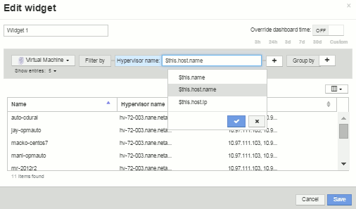

= 「$this」変数について説明します
:allow-uri-read: 
:icons: font
:imagesdir: ../media/

[role="lead"]
カスタマイズ可能なアセットの[Additional data]ページでは、特殊な変数を使用して、現在のアセットに直接関連する追加情報 を簡単に表示できます。

== このタスクについて

アセットのカスタマイズ可能なランディングページのウィジェットで「$this」変数を使用するには、次の手順を実行します。この例では、表ウィジェットを追加します。

[NOTE]
====
「$this」変数は、アセットのカスタマイズ可能なランディングページでのみ有効です。Insightの他のダッシュボードでは使用できません。使用可能な「$this'」変数は、アセットタイプによって異なります。

====

== 手順

. 目的のアセットのアセットページに移動します。この例では、仮想マシン（ VM ）のアセットページを選択します。クエリまたは検索を使用して VM を選択し、リンクをクリックしてその VM のアセットページに移動します。
+
VM のアセットページが開きます。

. [Change view]*>*[Additional Virtual Machine data]*ドロップダウンをクリックして、そのアセットのカスタマイズ可能なランディングページに移動します。
. [Widget]ボタンをクリックし、[Table Widget]*を選択します。
+
編集用の表ウィジェットが開きます。デフォルトでは、すべてのストレージが表に表示されます。

. すべての仮想マシンを表示します。アセットセレクタをクリックし、*[ストレージ]*を*[仮想マシン]*に変更します。
+
これで、すべての仮想マシンが表に表示されます。

. [列セレクタ]*ボタンをクリックしますimage:../media/column-picker-button.gif[""]そして、* hypervisor name *フィールドをテーブルに追加します。
+
表内の VM ごとにハイパーバイザー名が表示されます。

. 現在の VM をホストしているハイパーバイザーだけを表示します。[Filter by]*フィールドの[**+*]ボタンをクリックし、[hypervisor name]*を選択します。
. [Any]*をクリックし、*$ this.host.name *変数を選択します。チェックボタンをクリックしてフィルタを保存します。
+

. 表に、現在の VM のハイパーバイザーがホストしているすべての VM が表示されます。[ 保存（ Save ） ] をクリックします。

== 結果

表示するすべてのVMのアセットページに対して、この仮想マシンのアセットページ用に作成した表が表示されます。ウィジェットで*$ this.host.name *変数を使用すると、現在のアセットのハイパーバイザーが所有するVMのみが表に表示されます。
