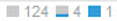

= [Anomalies]セクションを使用します
:allow-uri-read: 
:icons: font
:imagesdir: ../media/

[role="lead"]
[Anomalies]セクションは、アプリケーションのアセットページにのみ表示されます。このセクションでは、アプリケーションインフラの状況を分析し、サービスの停止を招くおそれのある異常な動作を特定できます。

== 手順

. 目的のアプリケーションで異常監視をオンにして、データを収集できるようにします。
. 異常検出エンジンの実行中は、アプリケーションのアセットページの* Anomalies *セクションで次の情報を確認できます。
+
** 異常検出スコアは、0~100のスコアを表す青いバーで示されます。スコアはリソース単位とカウンタ単位で行われ、アプリケーションインフラ全体の合計スコアが算出されます。
** アプリケーションアセットビュー
+
異常検出スコアの下には、すべてのアセットが現在の異常スコアにどのように影響しているかが表示されます。異常スコアに大きな影響を与えていないアセットはで表示されます image:../media/anomaly-score-none.gif[""]。異常スコアに影響しているアセットの場合は、次のように、1、2、または3つの青いバーが表示されます。 image:../media/anomaly-score-contributor.gif[""]。バーの数は、そのアセットが異常スコアにどの程度影響しているかを示します。1本のバー=1~33、2本のバー=34~67、3本のバー=68~100です。

+
異常検出スコアの要因となるのは、アプリケーションに割り当てられたアセット（ホスト、仮想マシン、ボリューム、内部ボリューム、ハイパーバイザー）と、割り当てられたアセットに何らかの形で接続されているインフラ内のアセット（ノード、ポートなど）です。特定の異常に関連するアセットと関連しないアセットの両方が表示されます。これは、割り当てられたアプリケーションリソースからのデータがそれらのアセットを通過する可能性があるためです。

+
1つのタイプのアセットの数が60を超える場合は、* More *ボタンが表示されます。このボタンをクリックすると、残りのアセットを表示できます。残りのアセットのステータス（例： が* More *ボタンの横に表示されます。この例では、表示されていないアセットの合計は129個で、そのうち124個は異常スコアに影響していませんが、そのうち5個は異常スコアにある程度影響しています。

** 異常グラフ
+
異常のグラフには、期間（3時間、24時間、3日間、7日間、30日間）における最も高い異常スコアがオレンジの丸で示されます。 またはカスタムの期間）がアプリケーションのアセットページで選択されていることを確認します。グラフの上にポインタをドラッグすると、時間範囲内の他のポイントについて、青い丸で示された異常スコアを確認できます。次に、青い丸をクリックします。 これにより、アプリケーションアセットビューが更新され、その時点でスコアに貢献したアセットが表示されます。

. アセットのパフォーマンスのトラブルシューティングを支援するために、アプリケーションのアセットページのエキスパートビューのグラフにアセットを追加するには、次の手順を実行します。
+
.. アプリケーションのアセットビューでアセットアイコンをクリックします。
+
アセットの名前（該当するアセットページへのハイパーリンク）、異常の原因となった指標、アセットの影響の度合い、およびエキスパートビューのグラフにアセットを追加するためのボタンが表示されます。

.. をクリックします image:../media/add-to-expert-view-graph.gif[""]。

+
エキスパートビューのグラフにアセットが追加されます。

