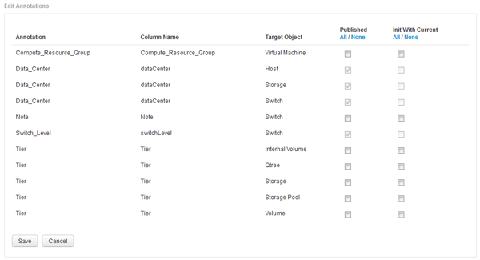

= Data Warehouseへのユーザ定義アノテーションのインポート
:allow-uri-read: 
:icons: font
:imagesdir: ../media/

[role="lead"]
OnCommand Insight で強制的にアノテーションを更新したら、Data Warehouseで必要なアノテーションを選択し、Data Warehouseのビルドを開始する必要があります。スケジュールされた次回のビルドまで待つか、今すぐビルドを開始できます。

== 手順

. Data Warehouseポータルに管理者としてログインします `+https://hostname/dwh+`、ここで `hostname` は、OnCommand Insight Data Warehouseがインストールされているシステムの名前です。
. 左側のナビゲーションペインで、*注釈*をクリックします。
+
image::../media/oci-dwh-admin-annotations-gif.gif[DWHのアノテーション]

+
リストには、アノテーションタイプごとに行が表示され、アノテーションを割り当てることができるターゲットオブジェクトが1つずつ表示されます。[Published]列のチェックマークは、アノテーションが特定のターゲットオブジェクトに対してすでに選択されており、Data Warehouseデータマートですでに使用できることを示しています。

. OnCommand Insight からアノテーションをインポートする方法を編集するには、*編集*をクリックします。
+
[Edit]をクリックします]

. アノテーションプロセスを編集するには、次の手順を実行します。
+
** OnCommand Insight から取得したアノテーションをData Warehouseデータベースに追加するには、* Published *を選択します。すべてのオブジェクトのすべての注釈を選択するには、*すべて*をクリックします。[なし]*をクリックして、すべてのオプションが選択されていないことを確認します。
+
[NOTE]
====
特定のオブジェクトのインベントリテーブルおよび関連するデータマートからアノテーション列を削除する場合は、このオプションをオフにします。カスタム設計のレポートでアノテーションデータが使用されている場合、そのレポートは正常に実行されません。

====
** Data Warehouseディメンションテーブルの履歴データを現在のアノテーション値で初期化する場合は、* Init with Current *をオンにします。すべてのオブジェクトのすべての注釈を選択するには、*すべて*をクリックします。[なし]*をクリックして、すべてのオプションが選択されていないことを確認します。このチェックボックスは、注釈がパブリッシュされると無効になります。このチェックボックスは、パブリッシュされていない注釈に対して有効になります。たとえば、アノテーションタイプ「`floor`」でアノテートされ、値「`1`」を取得したホストがhost_dimensionテーブルに3行ある場合、* Init with current *を選択すると、host_dimensionテーブルの3行すべてに対して「`floor`」列の値「`1`」が関連付けられます。「*現在の値で初期化*」が選択されていない場合、そのホストの最新の行だけが「floor」列に「1」と表示されます。

. [ 保存（ Save ） ] をクリックします。
+
アノテーションを削除すると、原因 によってデータ構造が変更されたりデータが失われたりすることを示す警告メッセージが表示されます。

. 続行するには、*[はい]*をクリックします。
+
Data Warehouseで非同期アノテーションジョブが開始され、要求された変更が適用されます。ジョブは[Jobs]ページで確認できます。Data Warehouseデータベーススキーマの変更内容を確認することもできます。

