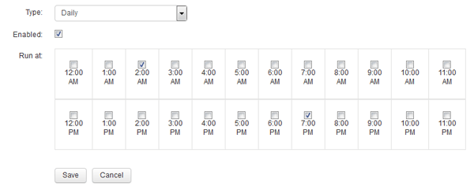

= 日次ビルドのスケジュール設定
:allow-uri-read: 
:icons: font
:imagesdir: ../media/

[role="lead"]
Data Warehouseは、[Build now]コントロールを使用していつでも手動でビルドできますが、ベストプラクティスとして、自動ビルドをスケジュールして、Data Warehouseデータベースをビルドするタイミングと頻度を定義することを推奨します。Data Warehouseでは、コネクタごとおよびデータマートごとにビルドジョブが実行されます。Data Warehouseでは、ライセンスとインベントリ用にコネクタごとにビルドジョブが実行され、それ以外のすべてのビルドジョブ（容量など）が統合データベースで実行されます。

== このタスクについて

Data Warehouseは、ビルドされるたびに、すべてのコネクタに対してインベントリジョブを実行します。インベントリジョブが完了すると、Data Warehouseでディメンション、容量、および残りのデータマートのジョブが実行されます。

== 手順

. Data Warehouseポータルにログインします `+https://hostname/dwh+`、ここで `hostname` は、OnCommand Insight Data Warehouseがインストールされているシステムの名前です。
. 左側のナビゲーションペインで、*[スケジュールの編集]*をクリックします。
+
image::../media/oci-dwh-admin-schedule-gif.gif[DWHのスケジュールのリンク]

. [スケジュールのビルド]*ダイアログボックスで、*[編集]*をクリックして新しいスケジュールを追加します。
+

. 頻度-毎週を選択してください。
. ジョブを実行する各曜日の時刻を選択します。
. ビルドを実行しない日数には「N/A」を選択します。
. スケジュールを有効にするには、*[有効]*を選択します。
+
[NOTE]
====
このチェックボックスをオンにしないと、スケジュールによるビルドは実行されません。

====
. [ 保存（ Save ） ] をクリックします。
. スケジュールされた自動ビルド以外でData Warehouseをビルドするには、*[今すぐビルド]*をクリックします。

