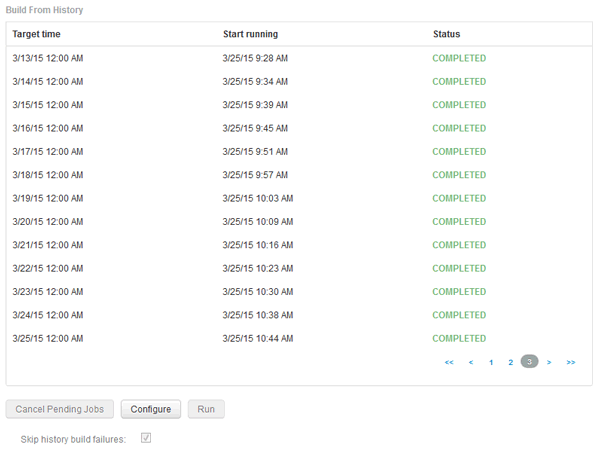

= 失敗したビルドをスキップします
:allow-uri-read: 
:icons: font
:imagesdir: ../media/

[role="lead"]
最初のビルドの後、ビルドが失敗することがあります。失敗したビルドのあとにすべてのジョブが正常に完了するようにするには、*[Skip history build failures]*オプションを有効にします。

== このタスクについて

ビルドが失敗し、*[Skip history build failures]*オプションが有効になっている場合、Data Warehouseはビルドを続行し、失敗したビルドは無視します。この場合、スキップされたビルドのデータポイントは履歴データにありません。

このオプションは、ビルドが失敗した場合にのみ使用してください。

[Build from History]でビルドが失敗し、*[Skip history build failures]*チェックボックスが選択されていない場合、以降のジョブはすべて中止されます。

== 手順

. Data Warehouseポータルにログインします `+https://hostname/dwh+`、ここで `hostname` は、OnCommand Insight Data Warehouseがインストールされているシステムの名前です。
. 左側のナビゲーションペインで、*[履歴からビルド]*をクリックします。
+
ビュー]

. [*Configure*] をクリックします。
. ビルドを設定します。
. [ 保存（ Save ） ] をクリックします。
. 失敗したビルドをスキップするには、*[ビルドの失敗の履歴をスキップする]*をオンにします。
+
このチェックボックスは、* Run *ボタンが有効になっている場合にのみ表示されます。

. スケジュールされた自動ビルド以外でビルドを実行するには、*[実行]*をクリックします。

