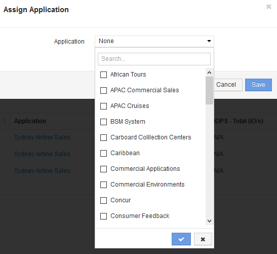

= クエリを使用してアセットにアプリケーションを割り当てます
:allow-uri-read: 
:icons: font
:imagesdir: ../media/

[role="lead"]
アプリケーションをアセットに割り当てて、アプリケーションが使用するアセットのリソースを識別できるようにします。アセットにコストが割り当てられている場合は、アプリケーションによって発生するコストを特定でき、リソースがサイズで測定される場合は、リソースを補充する必要があるかどうかを判断できます。

== このタスクについて

クエリを使用すると、1つのアプリケーションに複数のアセットを割り当てるタスクを簡易化できます。

== 手順

. アプリケーションを割り当てるアセットを特定するための新しいクエリを作成します。たとえば、地理的な場所に関連する特定の名前を持つホストに割り当てる場合は、*[Queries]>*[+ New Query]*をクリックします
. [ホスト]*をクリックします
. [名前]フィールドにと入力します `Chicago`
+
のすべてのホストが表示されます `Chicago` 名前の一部として。 image:../media/new-query.gif[""]

. クエリで特定されたホストを1つ以上選択します。
. [操作]*>*[アプリケーションの追加]*をクリックします
+

+
[アプリケーションの割り当て]ダイアログが表示されます。

. ホストに割り当てるアプリケーションを選択し、をクリックします image:../media/check-box-ok.gif[""]
. [ 保存（ Save ） ] をクリックします。
+
[User Data]セクションにアプリケーション名が表示されます。

