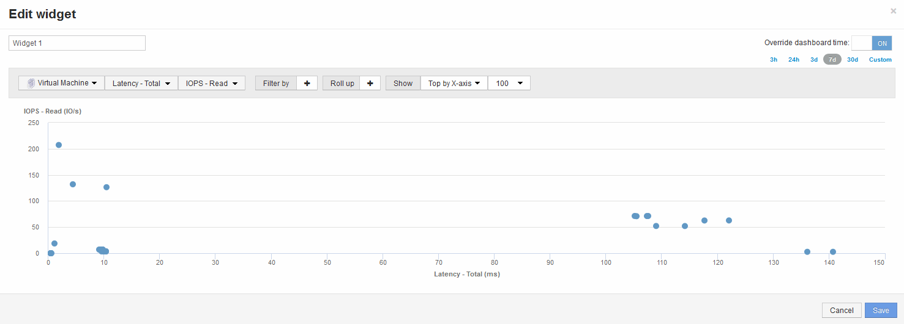

= 指標Aと指標Bを比較してカテゴリと異常を表示します
:allow-uri-read: 
:icons: font
:imagesdir: ../media/

[role="lead"]
散布図を使用して、オブジェクトごとに2セットのデータを表示できます。たとえば、各オブジェクトのIOPS読み取りと合計レイテンシを表示するように指定できます。このグラフを使用すると、IOPSと合計レイテンシの両方に基づいて、問題があると思われるオブジェクトを特定できます。

== 手順

. 散布図を含むウィジェットを新しいダッシュボードに追加します。* Widget *>* Scatter Plot Chart *
. デフォルトのデバイスを仮想マシンに変更します。*[ストレージ]*>*[仮想マシン]*>*[合計レイテンシ]*>*[IOPS読み取り]*をクリックします
+
次のような散布図が表示されます。 

