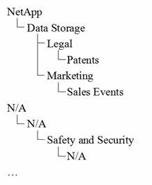

= 会社のビジネスエンティティの設定
:allow-uri-read: 
:icons: font
:imagesdir: ../media/

[role="lead"]
企業構造のビジネス要素を理解することで、資産の使用状況を追跡し、コストを報告することができます。ここでは、会社のビジネスエンティティを設定します。

== このタスクについて

OnCommand Insight では、ビジネスエンティティを最大4つのレベルの階層で定義できます。

* *テナント*
+
主にサービスプロバイダがリソースを顧客に関連付けるために使用します。テナントレベルは、ISPが顧客のリソース使用状況を追跡する場合に必要です。

* *基幹業務（LOB）*
+
企業内の基幹業務や製品ライン（データストレージなど）。異なる製品ラインのデータを追跡する必要がある場合は、基幹業務部門が階層に必要です。

* *ビジネスユニット*
+
法務部門やマーケティング部門などの従来のビジネスユニットを表します。部門ごとにデータを追跡する必要がある場合は、ビジネスユニットが必要です。この階層レベルは、1つの部門が使用するリソースと、他の部門が使用しないリソースを分離するのに役立ちます。

* * プロジェクト *
+
多くの場合、容量のチャージバックが必要なビジネスユニット内の特定のプロジェクトを識別するために使用されます。たとえば、法務部門のプロジェクト名は「特許」、マーケティング部門のプロジェクト名は「販売イベント」のようになります。レベル名にはスペースを含めることができます。

ビジネスエンティティ階層の例を次に示します。

ベストプラクティス：各行にビジネスエンティティが1つだけ表示される表を作成します。

|===

| テナント | 基幹業務部門 | ビジネスユニット | プロジェクト 

 a| 
NetApp Inc.
 a| 
データストレージ
 a| 
法律
 a| 
特許

 a| 
NetApp Inc.
 a| 
データストレージ
 a| 
マーケティング
 a| 
セールスイベント

 a| 
該当なし
 a| 
該当なし
 a| 
安全とセキュリティ
 a| 
該当なし

 a| 
...
 a| 
 a| 
 a| 

|===
[NOTE]
====
企業階層の設計では、すべてのレベルを使用する必要はありません。使用しないレベルには「N/A」を選択できます。

====
Insightでビジネスエンティティ階層を作成するには、次の手順を実行します。

== 手順

. 管理者権限を持つユーザとして Insight にログインします。
. [管理]*>*[ビジネスエンティティ]*を選択します。
. [+追加]*ボタンをクリックします
. [Tenant]*ボックスをクリックし、テナント名を入力します。
+
環境のテナントをすでに入力している場合は、既存のテナントのリストが表示され、そこから選択できます。テナントがこのビジネスエンティティに該当しない場合は、「N/A」を選択することもできます。

. [Line of Business]、[Business Unit]、[Project]についても同じ手順を繰り返します。
. [ 保存（ Save ） ] をクリックします。

== 完了後

ベストプラクティス：

* ビジネス階層をテーブルにマッピングし、Insightのビューやレポートでわかりやすい名前になっていることを確認します。
* アプリケーションを作成する前に、Insightでビジネスエンティティを作成します。
* 各ビジネスエンティティに関連付けるすべてのアプリケーションを特定してリストします。

