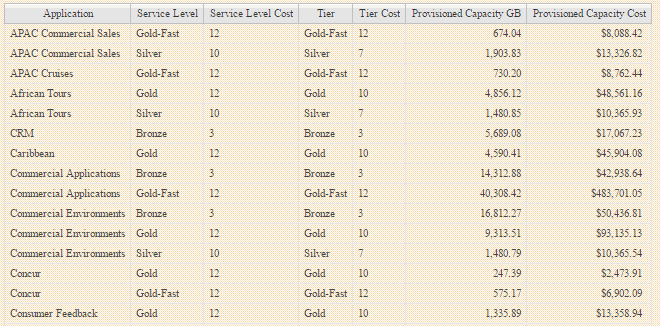

= 単純なチャージバックレポートの作成
:allow-uri-read: 
:icons: font
:imagesdir: ../media/

[role="lead"]
チャージバックレポートを使用すると、管理者やマネージャーは、アプリケーション、ビジネスエンティティ、サービスレベル、階層別に使用容量を評価できます。チャージバックレポートには、容量のアカウンタビリティ、過去の容量のアカウンタビリティ、トレンド分析データが含まれます。これらのレポートのデータは、OnCommand Insight データウェアハウスから構築およびスケジュール設定されます。

== 作業を開始する前に

サンプルレポートを作成するには、ストレージ階層のコストをレポートするようにシステムを設定する必要があります。次の作業を完了する必要があります。

* 階層のアノテーションを定義します。
* アノテーションにコストを割り当てます。
* データを追跡するアプリケーションを定義します。
* アプリケーションをアセットに割り当てます。

== このタスクについて

この例では、Cognos Workspace Advancedレポートツールを使用してチャージバックレポートを作成します。Workspace Advancedでは、データ要素をレポートパレットにドラッグアンドドロップしてレポートを作成できます。

== 手順

. OnCommand Insight Web UIで、レポートアイコンをクリックします。
. Reporting Portalにログインします。
. IBM Cognos Connectionツールバーで、* Launch *>* Cognos Worksapce Advanced *をクリックします
+
Workspace Advancedパッケージ画面が開きます。

. [パッケージ]*>*[チャージバック]*をクリックします
+
[IBM Workspace Advanace]画面が表示されます。

. [新規作成]*をクリックします
. [新しい*レポート]ダイアログで、*[リスト]*をクリックしてリストレポートを指定します。
+
レポートパレットが表示され、ソース見出しの下にチャージバックの「サンプルデータマート」と「高度なデータマート」が表示されます。

. 各データマートの横にある矢印をクリックして展開します。
+
データマートのすべての内容が表示されます。

. 「サンプルデータマート」からレポートパレットの左端の列に「アプリケーション」をドラッグします。
+
パレットに項目をドラッグすると、列が縮小されて強調表示されます。アプリケーションデータを強調表示された列にドロップすると、すべてのアプリケーションが列に正しく表示されます。

. 「単純なデータマート」からレポートパレットの次の列に「階層」をドラッグします。
+
各アプリケーションに関連付けられたストレージ階層がパレットに追加されます。

. 「Simple Data Mart」の「Tier Cost」をレポートパレットの次の列にドラッグします。
. [Simple Data Mart]から[Provisioned capacity]をレポートパレットの次の列にドラッグします。
. Ctrlキーを押しながら、パレットの「Tier cost」列と「Provisioned capacity」列を選択します。
. 選択した列のいずれかでマウスを右クリックします。
. [計算]*>*[ティアコスト]*[プロビジョニング済み容量DB]*をクリックします
+
「Tier Cost * Provision Capacity GB」というタイトルの新しい列がパレットに追加されます。

. [Tier Cost]*[Provision Capacity GB]*列を右クリックします。
. [スタイル]*>*[データ型]*をクリックします
. [書式の種類]*>*[通貨]*をクリックします
. [OK] をクリックします。
+
これで、列データがUS通貨としてフォーマットされました。

. [Tier Cost * Provision Capacity GB]を右クリックし、*[Edit Data Item Label]*を選択します
. [Name]フィールドを「Provisioned Capacity Cost」に置き換えます。
. レポートを実行するには、* Run *>* Run report -html *をクリックします
+
次のようなレポートが表示されます。 

