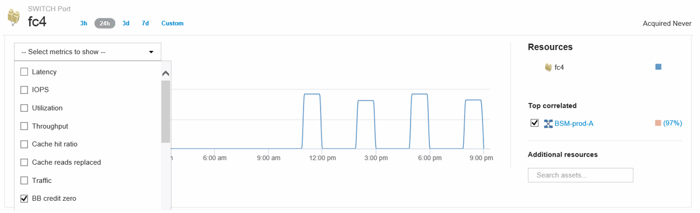
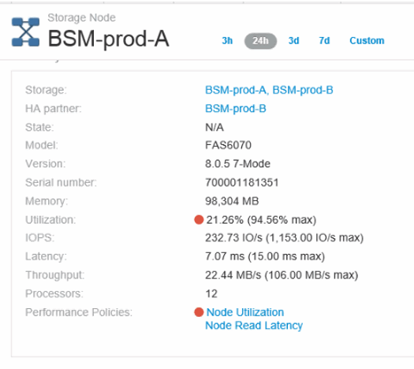

= ポートのパフォーマンスポリシーとしきい値を作成する
:allow-uri-read: 
:icons: font
:imagesdir: ../media/

[role="lead"]
ポートに関連付けられている指標のしきい値を設定したパフォーマンスポリシーを作成できます。デフォルトでは、パフォーマンスポリシーは作成時に指定したタイプのすべてのデバイスに適用されます。特定のデバイスまたはデバイスセットのみをパフォーマンスポリシーに含める場合は、アノテーションを作成します。わかりやすいように、この手順 ではアノテーションは使用しません。

== 作業を開始する前に

このパフォーマンスポリシーでアノテーションを使用する場合は、パフォーマンスポリシーを作成する前にアノテーションを作成する必要があります。

== 手順

. Insightのツールバーで、*[管理]*>*[パフォーマンスポリシー]*をクリックします
+
既存のポリシーが表示されます。スイッチポート用のポリシーが存在する場合は、既存のポリシーを編集して新しいポリシーとしきい値を追加できます。

. 既存のポートポリシーを編集するか、新しいポートポリシーを作成します
+
** 既存のポリシーの右端にある鉛筆のアイコンをクリックします。手順「d」および「e」で説明されているしきい値を追加します。
** [+追加]*をクリックして新しいポリシーを追加します
+
... 「ポリシー名」に「スロードレインデバイス」を追加します
... オブジェクトタイプとしてポートを選択します
... の"`Apply after window`"に最初に出現したものを入力します
... [BB credit zero - Rx]に「1,000,000」と入力します
... [BB credit zero - Tx]のしきい値として「1、000、000」を入力します
... [STOP processing further policies if alert is generated]をクリックします。
... 「保存」をクリックします。

+
作成したポリシーは、設定したしきい値を24時間監視します。しきい値を超えると、違反が報告されます。

. [ダッシュボード]*>*[違反ダッシュボード]*をクリックします
+
システムで発生したすべての違反が表示されます。違反を検索またはソートして、「低ドレインデバイス」違反を表示します。[Violations Dashboard]には、パフォーマンスポリシーに設定されたしきい値を超える「BB Credit 0」エラーが発生したすべてのポートが表示されます。[Violations Dashboard]で強調表示されている各スイッチポートからポートのランディングページへのリンクが表示されます。

. 強調表示されているポートのリンクをクリックすると、ポートのランディングページが表示されます。
+
ポートのランディングページが表示され、BBクレジット0のトラブルシューティングに役立つ次の情報が含まれます。

+
** ポートが接続されているデバイス
** 違反を報告しているポート（ファイバチャネルスイッチポート）のID。
** ポートの速度
** 関連付けられているノードとポートの名前image:../media/port-landing-page.gif[""]

. 下にスクロールしてポートの指標を確認します。Select metrics to show *>* BB credit zero *をクリックして、BBクレジットのグラフを表示します。
+

. [Top correlated]*をクリックします
+
関連する上位のリソース分析には、パフォーマンスと最も関連性の高いリソースとして、ポートに接続されているコントローラノードが表示されます。この手順では、ポートのアクティビティのIOPS指標をノードのアクティビティ全体と比較します。ディスプレイには、TxおよびRx BB Credit Zero指標とコントローラノードのIOPSが表示されます。ディスプレイには次の情報が表示されます。

+
** コントローラのIOは、ポートトラフィックと密接に関連しています
** ポートがサーバにIOを送信しているときにパフォーマンスポリシー違反が発生しました。
** ポートパフォーマンス違反がストレージコントローラの高いIOPS負荷に関連して発生していることから、ストレージノードのワークロードが違反の原因である可能性があります。image:../media/port-node-compare.gif[""]

. ポートのランディングページに戻り、ストレージコントローラノードのランディングページにアクセスしてワークロードの指標を分析します。
+
ノードは利用率違反を示し、指標はバッファ間クレジットのゼロ状態に関連する高い「キャッシュ読み取り回数」を示しています。

+

. ノードのランディングページで、関連するリソースリストからポートを選択し、指標メニューからノードの使用率データ（キャッシュ使用率データなど）を選択することで、BBクレジットのゼロ点を比較できます。
+
image::../media/node-port-comparison.gif[ノードポートの比較]

+
このデータから、キャッシュヒット率が他の指標と反比例していることがわかります。ストレージノードでは、キャッシュからのサーバの負荷に応答する代わりに、大量のキャッシュ読み取りが置き換えられています。ほとんどのデータをキャッシュではなくディスクから取得する必要があるため、ポートからサーバへのデータ送信に遅延が生じている可能性があります。パフォーマンス問題の原因 は、I/O動作の変化を引き起こしたワークロードであり、ノードキャッシュとその構成が原因 である可能性があります。この問題は、ノードのキャッシュサイズを増やすか、キャッシュアルゴリズムの動作を変更することで解決できる場合があります。

