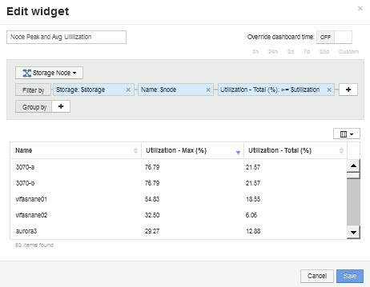
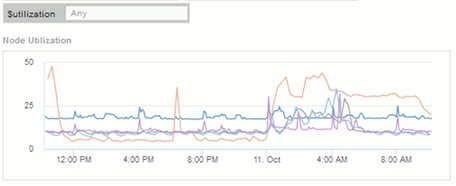

= 変数を含むストレージノードの利用率ダッシュボードの例
:allow-uri-read: 
:icons: font
:imagesdir: ../media/

[role="lead"]
ストレージ、ストレージプール、ノード、階層、利用率、レイテンシに変数を使用する Storage Analysis 用のカスタムダッシュボードを作成します。

== 作業を開始する前に

Insightのダッシュボードについてよく理解しておくことを推奨しますが、必須ではありません。

== このタスクについて

次の手順では、ストレージ、ストレージプール、ノード、階層、利用率、およびレイテンシに変数を使用する、カスタムの Storage Analysis Overview ダッシュボードを作成します。次の例の変数を使用して、ダッシュボードで使用できる 1 つ以上のウィジェットで表示するアセットや指標をフィルタリングします。これらの変数をフィルタとして使用するウィジェットは、ダッシュボードの変数フィールドに入力した値に従ってフィルタされたコンテンツをオンデマンドで表示するように更新されます。これにより、複数のグラフやグラフをすばやくフィルタして、関心のある特定の領域にドリルダウンできます。

この例の手順に従って、次のようなダッシュボードを作成します。これらのウィジェットを変更したり、任意の数のウィジェットを追加して、選択したデータを強調表示することができます。

image::../media/node-dashboard-example-2.gif[ノードのダッシュボードの例2.]

== 手順

. 新しいダッシュボードを作成し、「Analysis：Storage Overview」という名前か、わかりやすい名前を付けます。
. [変数（Variable）]*ドロップダウンをクリックし、*[テキスト（Text）]*変数タイプを選択します。デフォルトでは、変数の名前は_$var1_です。[_$var1_]をクリックして名前を編集し、[_$storage_]に変更してから、チェックマークをクリックして変数を保存します。を繰り返して、_$NODE_、_$POOL_、および_$VOLUME_のテキスト変数を作成します。
. 上記のプロセスを繰り返して、_$ utilization_および_$ latency _という名前の* number *タイプの変数を作成します。
. [Variable]*ドロップダウンをクリックし、_Tier_annotationを検索します。これを選択して、_$tier_という名前の変数を作成します。
+
変数はいつでも追加できますが、あらかじめ作成しておくと簡単に作成できるため、作成時にすべてのウィジェットで使用できるようになります。

. ウィジェットを追加するには、[Widget]ドロップダウンをクリックし、[**line chart*]または[*area chart*]ウィジェットを選択します。ウィジェットに「Node Utilization」という名前を付けます。アセットタイプ*[ストレージ]*をクリックし、*[ストレージノード]*に変更します。グラフデータとして* Utilization - Total *を選択します。
. [+でフィルタ]ボタンをクリックしてフィルタを追加します。[Storage]*を検索して選択し、*[Any]*をクリックして_$storage_variableを選択します。
. **+**ボタンをクリックして、*Name*に別のフィルタを追加します。変数を_$NODE_に設定します。
+
アノテーション名フィルタには、さまざまな変数を割り当てることができます。ウィジェットのオブジェクトに応じて、名前と変数のペアを最下位レベルで使用します。例：

+
** ノードにフォーカスしたウィジェットの* Name *フィルタに_$node_variableを割り当てることができます。
** プールに焦点を当てたウィジェットの* Name *フィルタに_$pool_variableを割り当てることができます。

. [*+*]ボタンをクリックして、* Utilization - Total (%)*用の別のフィルタを追加します。変数を_>=$utilization_に設定します。
. フィールドを折りたたむには、[**ロールアップ*]フィールドの後にある[*X]をクリックします。
. [Show Top 5]*を選択し、*[Save]*をクリックしてウィジェットを保存し、ダッシュボードに戻ります。
+
ウィジェットは次のようになります。

+
image::../media/widget-node-util-1.gif[ウィジェットノードutil 1]

. 別の折れ線グラフウィジェットまたは面グラフウィジェットをダッシュボードに追加します。アセットタイプとして*[ストレージノード]*を選択し、グラフの指標として*[レイテンシ-合計]*を選択します。
. [+でフィルタ]ボタンをクリックして、*[ストレージ：$STORAGE]*および*[名前：$NODE]*のフィルタを追加します。
. [Latency - Total]*のフィルタを追加し、*$latency *変数を選択します。
. ウィジェットに「Node Latency」という名前を付けて保存します。
. サポートテーブルを追加すると、作成したグラフの詳細（最大ノード利用率や平均ノード利用率など）を表示できます。ダッシュボードに* Tableウィジェット*を追加し、アセットタイプとして* Storage Node *を選択して、* Storage：$storage *、* Name：$node *、* Utilization - Total：$utilization *のフィルタを作成します。
. 表に、* Utilization - Max *、* Utilization - Total *、またはその他の必要な列を追加します。
. ウィジェットに「Node Peak and Avg Utilization」という名前を付けて保存します。
+

. 同じ手順を繰り返して、[ノードレイテンシ]の表を作成します。必要に応じて*[レイテンシ-最大]*、*[レイテンシ-合計]*、またはその他の列が表示されます。
. ダッシュボードを全体的に表示するには、次の一部またはすべてのグラフウィジェットと表ウィジェットを追加します。

|===

| チャート | 表 

 a| 
ストレージプール利用率
 a| 
ストレージプールの最大利用率と平均利用率

 a| 
ストレージプールのスループット
 a| 
ストレージプールの最大スループットと平均スループット

 a| 
ボリュームレイテンシ
 a| 
ボリュームの最大レイテンシと平均レイテンシ

 a| 
Volume IOPS の略
 a| 
ボリュームの最大IOPSと平均IOPS

|===
. ウィジェットは、ダッシュボードのどの位置にでも移動したり、サイズを変更したりできます。完了したら、必ず*[保存]*ダッシュボードを保存します。
+
最後のダッシュボードは次のようになります。

+
image::../media/node-dashboard-example-2.gif[ノードのダッシュボードの例2.]

. 変数を使用して、ダッシュボード内の特定のアセットに絞り込むことができます。変数フィールドに値を入力すると、ウィジェットが自動的に更新されて変数が反映されます。たとえば、$utilization変数フィールドに「15」と入力すると、その変数を使用するウィジェットには、合計利用率が15%以上のアセットのみが表示されます。
+
ノード利用率ウィジェットに表示されたすべてのノードのうち上位 5 つを表示：

+

+
ノード利用率ウィジェットに使用率が 15% 以上のノードが表示されている場合：

+

. ウィジェットを作成する際は、次の点に注意してください。
+
** $tier変数は、* Tier *アノテーションでアノテートされているリソースにのみ影響します。
** ウィジェットが指定した変数を受け入れるように設計されているかどうかによっては、すべてのフィルタがすべてのウィジェットに影響するわけではありません。
** 数値変数は、指定された値の"`greater than or equal"として適用されます。ストレージ階層のどのレベルのウィジェットでも、ウィジェットの実行元のアセットに対して変数が有効であれば、任意の変数をフィルタとして使用できます。ノードレベルからストレージプールからボリュームウィジェットに移動すると、フィルタとして割り当てる変数が増えます。たとえば、Storage Nodeレベルのウィジェットでは、_Storage_and_Name_変数をフィルタとして割り当てることができます。ストレージプールレベルでは、_ストレージ_、_ノード_、_ストレージプール_、_名前_がすべて使用可能です。必要に応じて変数を割り当て、スタック内の最下位レベルで $name 変数を使用します。これにより、ウィジェットを実行している実際のアセット名で $ name 変数をフィルタできます。

