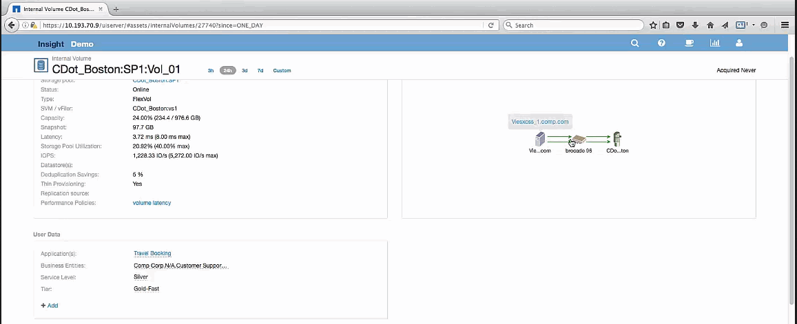

= 貪欲なリソースを調べています
:allow-uri-read: 
:icons: font
:imagesdir: ../media/

[role="lead"]
Greedyリソースと特定された内部ボリュームをクリックすると、ボリュームCDot_Boston：SP1：Vol_01のランディングページが開きます。

この内部ボリュームは、概要の詳細では別のアプリケーション（Travel Booking）のリソースであり、別のストレージプールに含まれていますが、Exchange 2016の内部ボリューム（CDot_Boston_N1）と同じノードにあります。

image::../media/cdot-boston-sp1-part2.gif[cdotボストンSP1パート2]

ランディングページには以下が表示されます。

* Travel Bookingアプリケーションに関連付けられている内部ボリューム。
* 新しいストレージプールが関連するリソースで識別されます。
* 調査していた元の内部ボリューム（CDot_Boston：SP2：Vol_01）は「Degraded」と表示されます。
* パフォーマンスグラフでは、アプリケーションのレイテンシは安定しており、IOPSの急増もExchangeアプリケーションのレイテンシとほぼ同じです。
+
これは、Exchangeアプリケーションでのレイテンシの急増が、このボリュームでのIOPSの急増が原因である可能性があることを示している可能性があります。

[Resource]セクションのグラフの右側に、関連付けられているDegradedリソース（Exchange 2016内部ボリュームCDot_Boston：SP2：Vol_01）が表示されます。チェックボックスをクリックして、パフォーマンスグラフにデグレード状態の内部ボリュームを含めます。2つのパフォーマンスグラフを合わせると、レイテンシとIOPSの急増がほぼ同じタイミングで発生していることがわかります。これは、Travel Bookingアプリケーションをよりよく理解したいことを示しています。アプリケーションでIOPSの急増がなぜ長引いているのかを理解する必要があります。

Travel Bookingアプリケーションに関連付けられているストレージプールを調べると、アプリケーションでIOPSの急増が発生している理由がわかる場合があります。[CDot_Boston：SP1]をクリックして、ストレージプールのランディングページを表示します。
