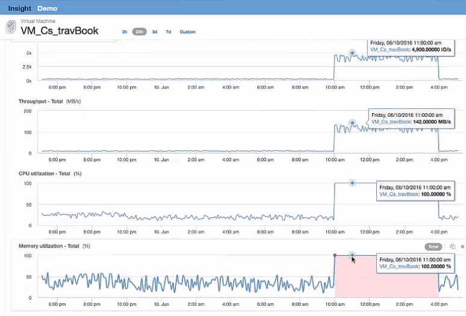

= VMを確認しています
:allow-uri-read: 
:icons: font
:imagesdir: ../media/

[role="lead"]
VMのランディングページで、CPU利用率とメモリ利用率を表示する追加の指標を選択します。CPUとメモリの利用率のグラフは、どちらも容量のほぼ100%で動作していることを示しています。これは、Exchangeサーバの問題はストレージの問題ではなく、VMのCPUとメモリの使用率が高く、結果としてディスクへのI/Oのメモリスワップが原因であることを示しています。

この問題を解決するには、追加の同様のリソースを探すことができます。[Additional resources]入力ダイアログに「Node」と入力し、Exchange VMに似たアセットの指標を表示します。この比較は、変更が必要な場合にワークロードをホストするのに適したノードを特定するのに役立ちます。

image::../media/resources-vm.gif[リソースVM]
