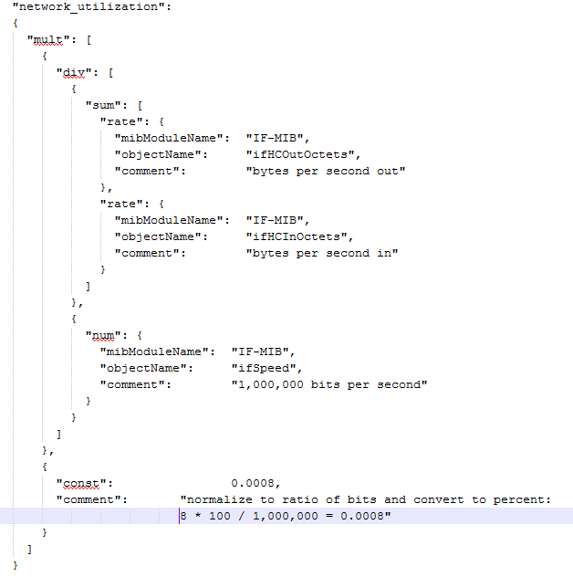

= integration.jsonファイルの情報
:allow-uri-read: 
:icons: font
:imagesdir: ../media/

[role="lead"]
integration.jsonファイルは、ペイロードを識別します。

次の図は、シンプルなintegration.jsonファイルを色分けしたものです。添付の表は、ファイル内のオブジェクトの機能を示しています。

image::../media/color-code-example.gif[カラーコードの例]

== integration.jsonファイルについて

各フィールドには次の特徴があります。

* 「identifiers」セクションは、Insightで新しい「オブジェクト」を作成するための一意の複合キーです
* 「attributes」は、オブジェクトに関するサポートメタデータを提供します。
+
どちらの場合も、そのオブジェクトの最新のレポートの値（識別子で識別）のみが保持されます。

* 「dataPoints」は時系列データであり、数値である必要があります。Insightでは、レポートされるすべての値を90日間（デフォルト）保持し、特定されたオブジェクトに時系列でリンクします。

== 数値式

デフォルトでは、すべての値式は統合ペイロードで文字列として報告されます。「identifiers」と「attributes」は文字列値のみを定義できます。「dataPoints」は文字列または数値を定義できます。数値は、次のいずれかの修飾キーを使用して定義されます。

* Num -カウンタが最後に初期化されてから受信した合計バイト数
* Delta -ポーリング間隔中に受信したバイト数
* rate -ポーリング間隔中の平均受信レート（1秒あたりのバイト数）
+
ポーリング間隔中の平均受信速度（1秒あたりのメガバイト数）は、rate処理とmath処理を組み合わせて実行できます

== 算術演算

。 `integration.json` ファイルは、加算、減算、乗算、除算の算術演算をサポートしています。次の例は、JSONファイルの乗算、除算、および合計の処理を示しています。

== キーワード

統合パックキーワードstringは、通常は16進数形式でレンダリングされ、代わりにASCII文字としてレンダリングされるオクテット文字列またはオクテット文字列から派生した独自の型を強制するために実装されています。

多くの場合、オクテット文字列には、MACアドレスやWWNなどのバイナリデータが含まれています。

[listing]
----
        "interface_mac": {
                  "mibModuleName":      "IF-MIB",
                  "objectName":         "ifPhysAddress"
                 }
----
ifPhysAddressはタイプPhysAddressです。これはオクテット文字列です。

[listing]
----
  PhysAddress ::= TEXTUAL-CONVENTION
                DISPLAY-HINT "1x:"
                STATUS       current
                DESCRIPTION
                                "Represents media- or physical-level addresses."
                SYNTAX       OCTET STRING
----
ifPhysAddressがデフォルトで16進数でレンダリングされると、結果は次のようになります。

[listing]
----
"interface_mac": "00:50:56:A2:07:E7"
----
ただし、ASCIIとして解釈するオクテット文字列またはオクテット文字列から派生した独自の型がある場合は、「string」キーワードを使用できます。

[listing]
----
        "string_test_1": {
          "string": {
            "mibModuleName":      "IF-MIB",
            "objectName":         "ifPhysAddress"
          }
        },

        "string_test_2": {
          "string": [
            {
              "mibModuleName":      "IF-MIB",
              "objectName":         "ifPhysAddress"
            },
            {
              "const": "JSD"
            },
            {
              "mibModuleName":      "IF-MIB",
              "objectName":         "ifPhysAddress"
            }
          ]
        }
----
次の例では、キーワードは既存の文字列連結規則に従い、用語の間に1つのスペースを挿入します。

[listing]
----
      "string_test_1": "PV¢ç",
              "string_test_2": "PV¢ç JSD PV¢ç"
----
「string」キーワードは、1つの用語または用語のリストに作用しますが、ネストされた式には作用しません。ネストされた式は、dataPoint式でのみサポートされます。datapoint式で"string"式を使用しようとすると、次のようなエラーが発生します。

_java.lang.IllegalArgumentException:インテグレーションパック'GenericSwitch32'インデックス'snmp_generic_interface_32'セクション'dataPoints'キー'String_test_3'サポートされていないJSON数値式'{"string":{"mibModuleName":"if-mib",":":"ifPhysAddress"}}}'_

DisplayString、SnmpAdminStringなどの一部の派生オクテット文字列タイプは、「string」キーワードよりもハードコードされています。これは、SnmpAdminStringがUTF-8で特別にエンコードされており、正しく処理したいためです。一方、「string」キーワードは、1文字あたりのシングルバイトASCIIコードを想定したsnmp_frameworkから返されるデフォルトの文字列表現を強制的に使用します。
