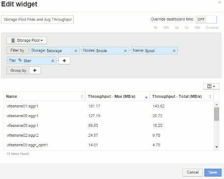

= ノードダッシュボードウィジェットの設定例
:allow-uri-read: 
:icons: font
:imagesdir: ../media/

[role="lead"]
ノードダッシュボードのウィジェット設定と変数の例。

以下は、ストレージノードダッシュボードの各ウィジェットの設定例です。

ノード利用率：

image:../media/nodeutilchart.gif[""] image:../media/nodeutiltable.gif[""]

ノードのレイテンシ：

image:../media/nodelatencychart.gif[""] image:../media/nodelatencytable.gif[""]

ストレージプールの利用率：

image:../media/poolutilchart.gif[""] image:../media/poolutiltable.gif[""]

ストレージプールのスループット：

image:../media/poolthroughputchart.gif[""] 

ボリュームレイテンシ：

image:../media/vollatencychart.gif[""] image:../media/vollatencytable.gif[""]

ボリュームIOPS：

image:../media/voliopschart.gif[""] image:../media/voliopstable.gif[""]
