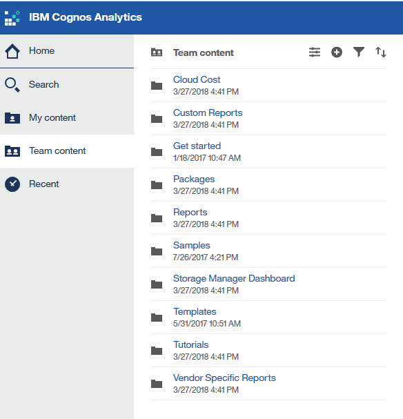

= 事前定義済みのOnCommand Insight レポートへの移動
:allow-uri-read: 
:icons: font
:imagesdir: ../media/

[role="lead"]
Reportingポータルを開くと、OnCommand Insight レポートで必要な情報のタイプを選択するには、[チーム]コンテンツフォルダが出発点になります。

== 手順

. 左側のナビゲーションペインで、*[チームコンテンツ]*をクリックし、使用する情報カテゴリを選択します。
+

. [*Reports] をクリックして、事前定義済みレポートにアクセスします。
. レポートの作成方法については、*[はじめに]*、*[サンプル]*、*[チュートリアル]*をクリックしてください。

